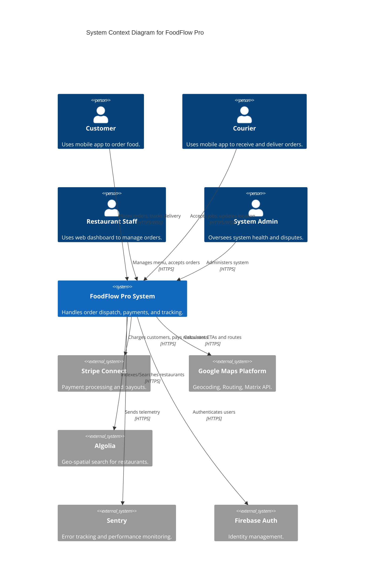
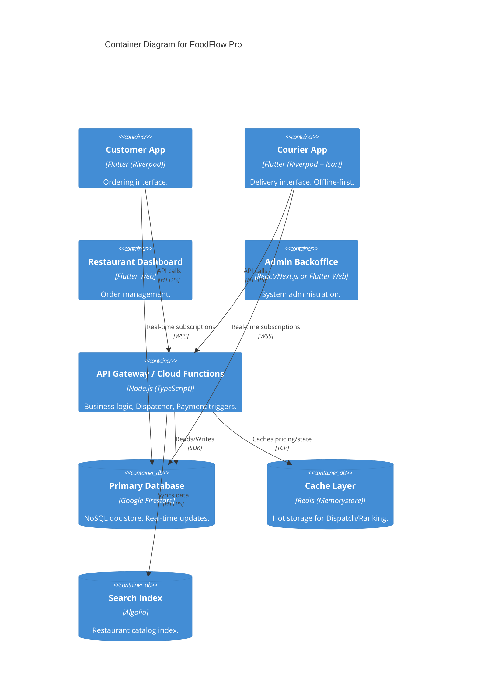
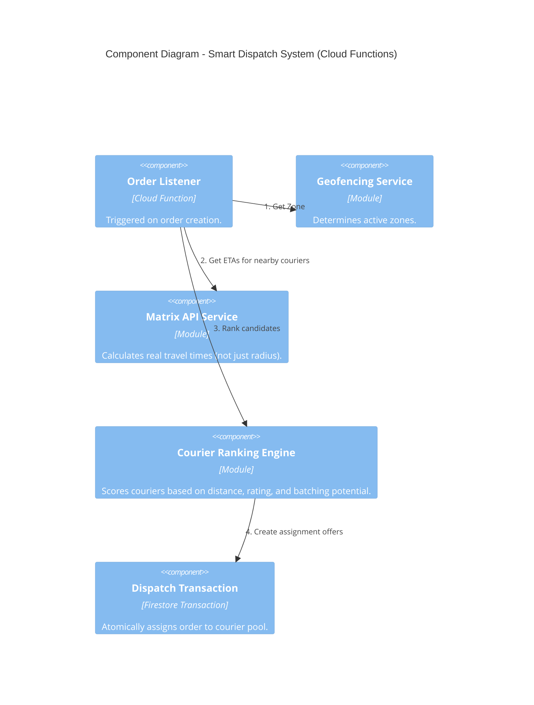

# Architecture C4 - FoodFlow Pro (Enterprise Edition)

## 1. System Context Context

## 2. Container Diagram

## 3. Dynamic Dispatch Component (The "Brain")

## 4. Resilience & Security Patterns
- **Device Fingerprinting**: Capturing device hardware IDs on login to prevent fraud.
- **Offline-First (Courier)**: Isar database stores 'active job' locally. Syncs when network returns.
- **Idempotency**: All payment functions use idempotency keys to prevent double-charging.
- **Circuit Breaker**: If Google Maps API fails, fallback to simple Haversine distance calculation.
